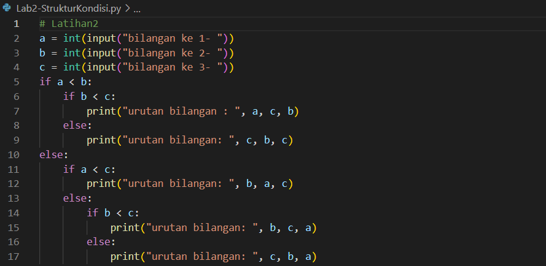
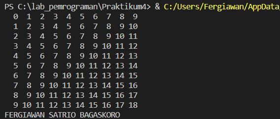
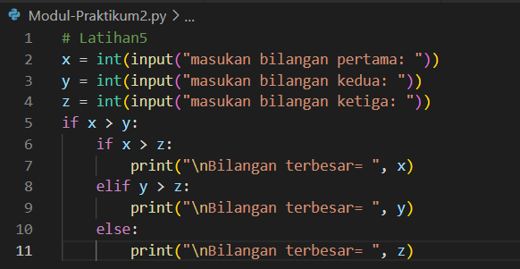
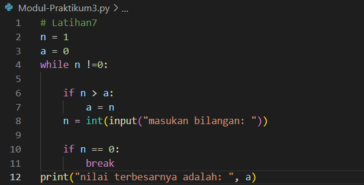
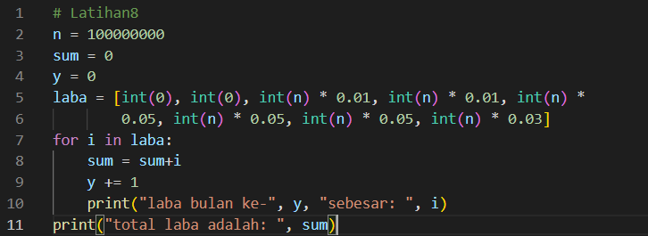
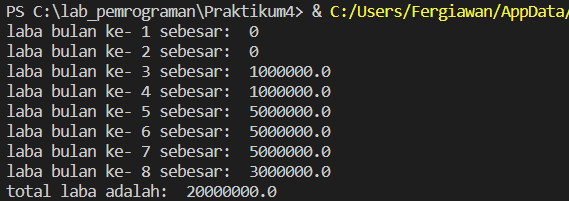

# Praktikum4
# Fergiawan Satrio Bagaskoro

## Lab2 : Struktur Kondisi
### Latihan 1
Di latihan pertama ini kita akan menambahkan 2 bilangan dan akan menentukan bilangan mana yang terbesar 
menggunakan statement if
```
x = int(input("masukan bilangan pertama: "))
y = int(input("masukan bilangan kedua: "))
if x > y:
    print("bilangan terbesar= ", x)
else:
    print("bilangan terbesar= ", y)
```


Kemudian kita run dan outputnya akan seperti dibawah


bisa dilihat gambar diatas kita menginput 2 bilangan yang pertama 8 dan kedua 4 dan dengan code program
diatas saya bisa mengetahui bilangan terbesar diantara 2 bilangan yang kita input

### Latihan 2
Di latihan ke 2 ini kita akan menginput 3 bilangan dan akan mengurutkan bilangan tersebut dari yang terkecil hingga terbesar
```
a = int(input("bilangan ke 1- "))
b = int(input("bilangan ke 2- "))
c = int(input("bilangan ke 3- "))
if a < b:
    if b < c:
        print("urutan bilangan : ", a, c, b)
    else:
        print("urutan bilangan: ", c, b, c)
else:
    if a < c:
        print("urutan bilangan: ", b, a, c)
    else:
        if b < c:
            print("urutan bilangan: ", b, c, a)
        else:
            print("urutan bilangan: ", c, b, a)
```



Disini kita akan menginputkan 3 bilangan yaitu 3,2, dan 1 dan outputnya akan seperti dibawah


## Lab3 : Perulangan
### latihan 1
Kita masuk ke latihan pertama yaitu perulangan atau *nested* dengan code program seperti dibawah ini
```
for i in range(0, 10):
    for j in range(0, 10):
        product = i+j
        print(f"{product:>3}", end='')
    print()
```


Dan akan menghasilkan output seperti dibawah



### Latihan 2
Di latihan kedua ini kita akan mencoba menampilkan 5 bilangan dengan nilai ramdom yang lebih kecil dari 0.5
```
import random
n = int(input("masukan nilai N: "))
for i in range(n):
    a = random.uniform(0.0, 0.5)
    print("data ke: ", i+1, "=> ", a)
```


Lalu kita input nilai N nya dengan 5 dan akan menghasilkan output seperti dibawah


## Modul Praktikum 2
Di latihan ini kita akan mencoba menginput 3 bilangan dan akan menentukan bilangan terbesarnya
```
x = int(input("masukan bilangan pertama: "))
y = int(input("masukan bilangan kedua: "))
z = int(input("masukan bilangan ketiga: "))
if x > y:
    if x > z:
        print("\nBilangan terbesar= ", x)
    elif y > z:
        print("\nBilangan terbesar= ", y)
    else:
        print("\nBilangan terbesar= ", z)
```



Kita input 3 bilangan dengan nilai 6,4, dan 2 dan outputnya seperti dibawah


## Modul Praktikum 3
### Latihan 1
Selanjutnya kita akan mencoba menampilkan beberapa bilangan dengan nilai random yang kurang dari 0.5
```
import random
n = int(input("masukan nilai N: "))
for i in range(n):
    a = random.uniform(0.0, 0.5)
    print("data ke: ", i+1, "=> ", a)
print("FERGIAWAN SATRIO BAGASKORO")
```


Dan outputnya akan seperti dibawah


### Latihan 2
Di latihan kedua kali ini kita bisa memasukan data sebanyak yang kita mau dan kalau kita ingin berhenti menginput data kita 
bisa menginput nilai 0 dan program akan mencari nilai terbesar dari data-data yang kita input
```
n = 1
a = 0
while n !=0:

    if n > a:
        a = n
    n = int(input("masukan bilangan: "))

    if n == 0:
        break
print("nilai terbesarnya adalah: ", a)
```



Disini saya menginput 5 bilangan dengan nilai yang berbeda-beda dan outputnya akan seperti dibawah


### Latihan 3
latihan terakhir ini kita akan menghitung presentase laba dari usaha kita setiap bulannya
```
n = 100000000
sum = 0
y = 0
laba = [int(0), int(0), int(n) * 0.01, int(n) * 0.01, int(n) *
        0.05, int(n) * 0.05, int(n) * 0.05, int(n) * 0.03]
for i in laba:
    sum = sum+i
    y += 1
    print("laba bulan ke-", y, "sebesar: ", i)
print("total laba adalah: ", sum)
```



Maka outputnya akan seperti dibawah




